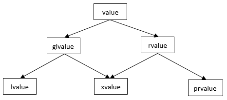

## 左值和右值
左值：可以取地址的就是左值。  
右值：不可以取地址就是右值。  

C++11中引入了右值引用，又将右值分为了将亡值和纯右值。

将亡值：返回右值引用的函数的调用表达式，转换为右值引用的转换函数的调用表达式。    
纯右值：字面量/临时对象等。

## 左值和右值的使用场景
左值通常用于需要持久状态和多次访问的场景，右值适用于临时数据和一次性操作。

## 左值引用和右值引用
左值引用：能指向左值、不能指向右值的引用。（const 左值引用除外）因为左值引用可以修改指向对象的值，而右值没有地址，无法被修改，所以非const左值引用不能指向右值；而const左值引用不会修改指向的对象，所以可以指向右值。

右值引用：能指向右值、不能指向左值的引用。

## std::move
std::move并不能移动任何东西，它唯一的功能是将一个左值强制转化为右值引用，继而可以通过右值引用使用该值，以用于移动语义。从实现上讲，std::move基本等同于一个类型转换：`static_cast<T&&>(lvalue)`.

## 移动语义
把数据从一个对象中转移到另一个对象中，从而避免拷贝操作所带来的性能损耗。  
通过移动构造函数和移动赋值运算符实现移动语义。

## 参考
[一文读懂C++右值引用和std::move](https://zhuanlan.zhihu.com/p/335994370)  
[话说C++中的左值、纯右值、将亡值](https://www.cnblogs.com/zpcdbky/p/5275959.html)  
[一文入魂：妈妈再也不担心我不懂C++移动语义了](https://zhuanlan.zhihu.com/p/455848360)