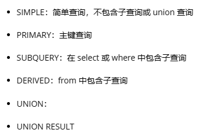
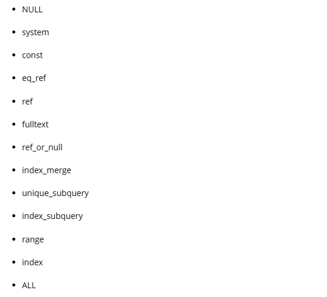

EXPLAIN语句可以查看SQL语句的执行计划。EXPLAIN并不会真的去执行相关的语句，而是通过查询优化器对语句进行分析，找出最优的方案，并显示对应的信息。

- ID字段：表明 MySQL 执行时从各表取数据的顺序，一般有几个select就有几个id。一般情况下遵循下面两个原则：
  - ID相同的组，执行优先级按顺序由上到下；
  - ID越大的组，执行优先级越高。

- select_type字段：表示该SQL是什么查询类型，一共有以下6种：

- table字段：表示数据来自哪张表。

- type字段：表示访问类型，即MySQL决定如何查找表中的行。查询效率从最好到最差如下：

- possible_keys字段：查询可能用到的索引。

- keys：实际用到的索引。

- key_len字段：索引中使用的字节数。

- ref：表示哪些索引列或常数被用到了。

- rows：找到所需数据需要读取的行数。

- filtered：结果行占读取行数的百分比。

- extra：额外信息，
