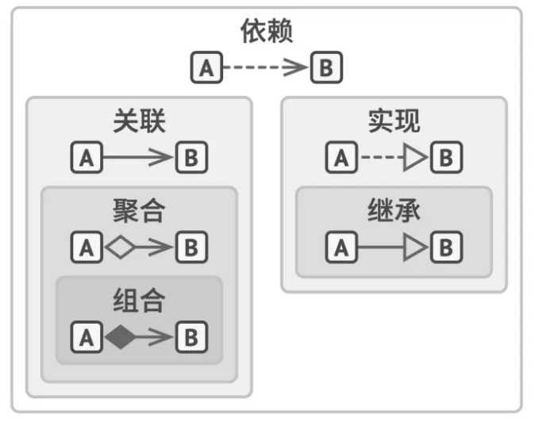

UML中的图：
- 用例图
- 静态结构图：类图、对象图、包图、组件图、部署图；
- 动态行为图：交互图（时序图与协作图）、状态图、活动图；

---

类之间的关系：泛化、实现、关联、聚合、组合、依赖。

- 泛化（继承）：类的继承关系。
- 实现：类与接口的关系，表示类是接口所有特征和行为的实现。
- 关联：关联是一种拥有关系，一个类可以调用另一个类的公有的属性和方法，在类中以成员变量的方式表示。
- 聚合：一种特殊的关联关系，整体与部分的关系，不过部分离开整体后可以单独存在。
- 组合：也是一种特殊的关联关系，和聚合的区别在于，部分离开整体后不可以单独存在，代表整体的对象负责代表部分的对象的生命周期。
- 依赖：是一种使用的关系，常用于类方法的局部变量、方法参数等。

> 聚合是一种特殊的关联关系，它是较强的一种关联关系，强调的是整体与部分之间的关系，从语法上是没办法区分的，只能从语义上区分。组合也是关联关系的一种特例，这种关系比聚合关系更强。它强调了整体与部分的生命周期是一致的，而聚合的整体和部分之间在生命周期上没有什么必然的联系.