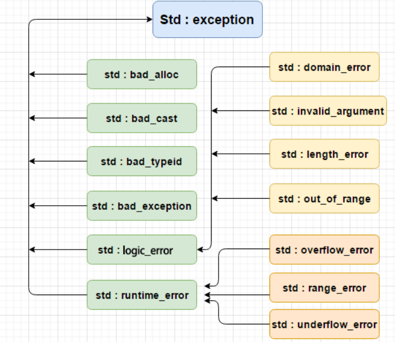

## 基本使用

```cpp
    try {
        int a, b; std::cin >> a >> b;
        if(b == 0) {
            throw std::runtime_error("unexpected zero");
        } else {
            cout << a / b << endl;
        }
    } catch(std::exception &e) { 
        cout << "runtime_error: " << e.what() << endl;
    }
```
异常类都实现了what函数返回相关信息。
catch()要使用引用接收参数。


## 异常安全
异常安全是指当异常发生时，既不会发生资源泄漏，系统也不会处于一个不一致的状态。  
异常被抛出后，从进入try块起，到异常被抛掷前，这期间在栈上构造的所有对象，都会被自动析构。析构的顺序与构造的顺序相反。这一过程称为栈的解旋。

## 异常缺点
异常产生的位置决定了需要如何做栈展开，这些数据需要存储在表里，会增加二进制文件的大小。

## noexcept
noexcept指示编译器某个函数不会抛出异常，编译器可以根据声明优化代码。（具体优化什么看看下面异常的缺点）  
当我们在声明了noexcept的函数中抛出异常时，程序会调用std::terminate去结束程序的生命周期。

vector 会在元素类型没有提供保证不抛异常的移动构造函数的情况下，在移动元素时会使用拷贝构造函数。这是因为一旦某个操作发生了异常，被移动的元素已经被破坏，处于只能析构的状态，异常安全性就不能得到保证了。

对于肯定不会抛出异常的代码，将其标为 noexcept。尤其是，移动构造函数、移动赋值运算符和 swap 函数一般需要保证不抛异常并标为 noexcept（析构函数通常不抛异常且自动默认为 noexcept，不需要标）。

## C++标准异常



## 自定义异常类型
继承标准库中的异常，再实现纯虚函数what即可。
```cpp
class myException:public std::exception
{
public:
	myException(const char* msg): m_msg(msg) {}
 
	const char* what()const noexcept override {
		return m_msg.c_str();
	}
protected:
	std::string m_msg;
};

```

## 参考
[[C++] 异常处理的细节](https://www.bilibili.com/video/BV1944y1N7Ej/?spm_id_from=333.337.search-card.all.click&vd_source=290e10e6da0d78fd6c632cdb3be20ba1)  
[C++异常处理|菜鸟教程](https://www.runoob.com/cplusplus/cpp-exceptions-handling.html)  
[noexcept|爱编程的大丙](https://subingwen.cn/cpp/noexcept/)  
极客时间-现代C++编程实战