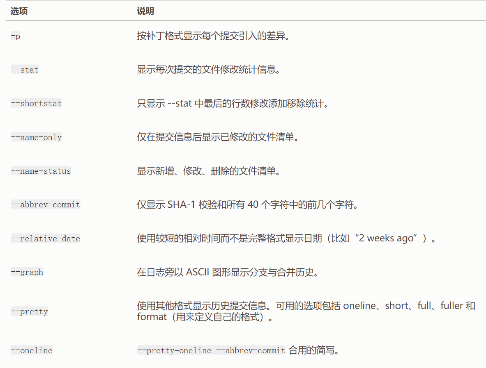

[Git 基本操作 | 菜鸟教程](https://www.runoob.com/git/git-tutorial.html)


---

## 配置用户信息
```shell
git config --global user.name   "xxx"
git config --global user.email  "xxx"
git config --global core.editor  vim
git config --list    # 查看配置信息
```
---

## 2.1获取Git仓库
```shell
git init              # 在已存在目录中初始化仓库
git clone [URL] [newDirName]  # 克隆现有的仓库
```

---

## 2.2记录每次更新到仓库
```shell
git status     # 检查当前文件状态, -s/--short简洁格式
git add [filename] # 跟踪新文件(如果在git add后又修改了对应文件，需要重新运行git add把最新版本重新暂存起来)
.gitignore忽略文件
```

#### 查看已暂存和未暂存的修改
```shell
git diff     # 默认查看尚未暂存的文件更新了哪些部分，比较的是工作目录中当前文件和暂存区域快照之间的差异
git diff --staged/cached  # 查看已暂存的将要添加到下次提交里的内容，也就是对比已暂存文件与最后一次提交的文件差异
```

#### 提交更新
```shell
git commit   # 启动你选择的文本编辑器来输入提交说明
git commit -m "commit message"  # -m直接输入提交说明
```

#### 跳过使用暂存区域
```shell
git commit -am "commit message"  # 自动把所有已经跟踪过的文件暂存起来一并提交(注意是已经跟踪过的文件)
```

#### 移除文件
```shell
git rm [filename]  # 将filename从已跟踪文件清单（暂存区）中移除，并且会从工作目录中删除指定的文件。
git rm --cached [filename]  # 将filename从已跟踪文件清单（暂存区）中移除，不会从工作目录中删除指定的文件。
# 如果要删除的文件修改过但是还没有commit，需要-f强制删除，或--cached保留在当前工作目录中。
```

#### 移动文件
```shell
git mv [file_from] [file_to]
```

---

## 2.3查看提交历史


---

## 2.4撤销操作


---


#### 分支管理

```shell
git branch          # 列出所有分支
git branch dev      # 创建dev分支

git checkout dev      # 切换到dev分支
git checkout -b dev   # 创建dev分支并切换到该分支下

git switch dev      # 切换到dev分支
git switch -c dev   # 创建dev分支并切换到该分支下

git branch -d dev   # 删除dev分支

git merge dev      # 将dev分支合并到当前分支

git merge --abort   # 退出合并的中间状态
```


## 3.远程仓库
生成ssh密钥
ssh-keygen -t rsa -C "youremail@example.com"

### 3.1添加远程库

添加远程库
git remote add origin git@github.com:[username]/learngit.git

git push -u origin master   
加上了-u参数，Git不但会把本地的master分支内容推送的远程新的master分支，还会把本地的master分支和远程的master分支关联起来，在以后的推送或者拉取时就可以简化命令。

查看远程库信息
git remote -v  

解除本地和远程的绑定关系
git remote rm origin

### 3.2从远程库克隆

git clone [url]


大家好，我叫袁俊，我要分享的是pro git这本书的第6-10章，主要分享三个部分分别是github的使用，一些git工具以及git的内部原理。

首先github是一个代码托管平台，使用git作为它的版本控制工具，我们要使用github的话首先可以使用邮箱注册一个账号，然后配置一下SSH公钥，基本就可以开始使用了。我们最常用的场景应该是我们想要参与到某个项目中，但是并没有push权限，这时可以对这个项目进行Fork也就是派生项目，当我们fork一个项目之后，GitHub就会在我们自己的空间中创建一个完全属于我们的项目副本，且我们对这个副本具有push权限。大概的工作流程就是首先fork对应的项目并且克隆到本地；再从master分支创建一个新分支；在这个分支上提交一些修改来改进项目；再将这个分支推送到github上；最后在github上创建一个拉取请求也就是pull request；项目的拥有者可以合并或关闭我们的拉取请求。


然后Git工具这部分主要介绍的是一些git中功能很强大但是使用频率没那么高的工具。
    第一个交互式暂存，当我们修改了大量文件但是希望把这些改动拆分成若干提交时，可以输入git add -i进入一个交互式界面，这个界面中可以选择暂存或取消暂存特定的文件，比如这里我们只想要暂存TODO和index.html文件，可以先输入2或者u，然后输入TODO和index.html文件对应的编号也就是1和2，然后可以看到这两个文件已经被暂存；还可以输入p暂存补丁也就是暂存文件特定部分的修改，比如在文件做了两处修改，但只想要暂存其中的一个。

    第二个贮藏与清理主要涉及到git stash和git clean两个命令，当我们对当前工作区做了修改但是还没有提交修改，如果此时想切换到另一个分支上时，git会让我们先提交修改否则切换分支失败，我们可以使用git stash先贮藏修改，切换回来的时候再用git stash apply把上一次存储的状态读取出来，重新应用之前的修改，但是这个状态在被读取之后不会被删除，可以使用git stash drop手动删除或者读取的时候直接使用git stash pop；git clean命令就是删除当前工作目录中未被跟踪的文件。

    第三个部分是重写历史，我们有时候可能需要修改提交历史，比如对于最后一次提交，我们有时候可能想修改提交信息或者添加、删除、修改文件来更改提交实际的内容，可以使用commit的--amend参数；
    如果要修改多个提交历史可以使用git rebase -i，比如这里输入git rebase -i HEAD~3之后会显示这三行内容，如果我们只想修改第三次提交信息，可以将对应第三次提交前面的pick改为edit，然后会显示如下提示信息，git commit --amend修改提交信息，然后输入git rebase continue会自动应用另外两个提交，如果需要将不止一处的pick改为edit，只需要在每一个修改为edit的提交上重复这些步骤就行了；我们还可以通过这个命令来合并历史提交，将要被合并的提交前面的pick改为squash即可。

    第四个部分是重置揭密，主要是介绍git reset的原理。一般我们的git操作都要涉及到这三个部分，分别是HEAD是当前分支引用的指针，总是指向该分支上的最后一次提交；index是预期的下一次提交，也就是我们常说的暂存区，working directory就是工作区。当我们创建了一个名为file.txt的文件并且修改了两次，每次都提交了修改，这三个部分的内容应该是这样，都是最新的提交内容；如果此时我们进行git reset的话，它会进行三步操作，第1步是移动HEAD的指向，本质上就是撤销了上一次git commit命令，将分支移动回原来的位置，而不会改变索引和工作目录；第2步是更新索引，它会取消暂存所有的东西，也就是回滚到git add和git commit命令执行之前；第3步是更新工作目录，就是让工作区中的内容和索引也就是暂存区保持一致。
    当我们指定--soft参数时候reset会在执行完第一步之后就停止，如果没有指定任何参数，会默认在执行完第二步后停止，只有指定了--hard参数才会完整执行这3步。

    第五个部分是子模块，它允许我们将一个Git仓库作为另一个Git仓库的子目录，同时允许我们在一个项目中使用其他项目的特定版本，而无需将整个子项目的代码复制到主项目中。比如我们在开发过程中很有可能使用到第三方库比如测试框架googletest，我们可以直接将要用到的第三方库作为当前项目的子模块，就是一个url链接，相当于文件夹的快捷方式，要添加子模块的话直接git submodule add仓库的地址以及要放在那个子目录中，然后就可以使用了。


然后Git内部原理的主要内容讲的是Git命令工作的底层原理。
    当我们使用git init或clone初始化一个git仓库时，也会创建一个.git文件夹用来保存当前项目的一些版本信息，这个文件夹下包括四个很重要的部分，分别是HEAD文件指向当前所在的分支，index文件保存暂存区的内容，objects文件夹中存储git仓库的所有对象包括blob、tree和commit，refs文件夹中存储指向提交对象的引用。

然后具体说一下啊git中比较重要的对象类型：

可以通过这三种对象大概解释git管理文件版本的原理：
    每个源文件内容本身映射成blob对象，使用SHA-1算法生成的校验和来唯一标识blob对象，而文件名和文件路径映射成tree；
    然后使用commit索引tree，blob来追踪还原工作区的所有文件，一个commit就是一个完整的版本副本；
    commit会自动追加成commit链能追踪所有历史快照。