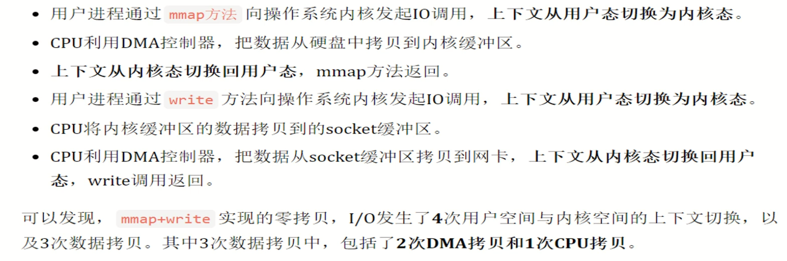
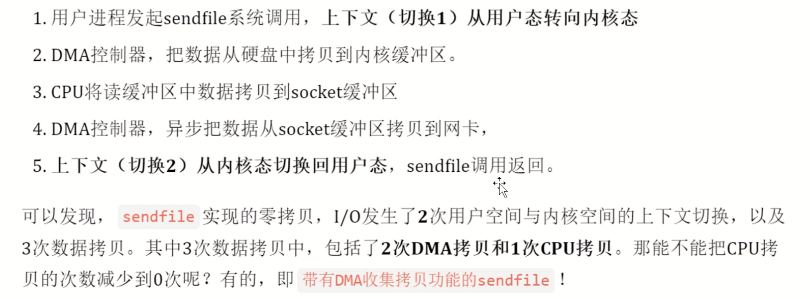
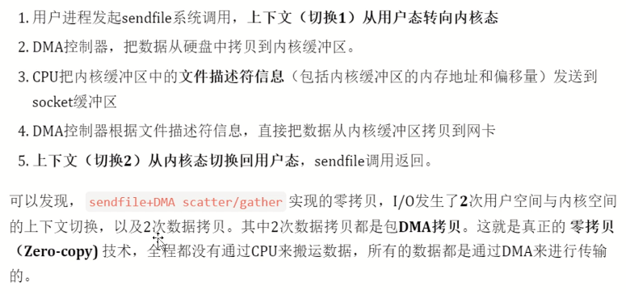

什么是零拷贝？

避免内核缓冲区到用户缓冲区之间的数据拷贝，从而可以减少用户态和内核态的上下文切换和CPU的拷贝时间。

---

零拷贝的实现方式？

- mmap + write
`mmap`是一种常用于文件读取和写入的系统调用，`mmap`通过将文件映射到进程的虚拟地址空间中来实现对文件的操作。这样就可以直接对内存进行读写操作，从而省去了繁琐的读写文件的操作。
调用`mmap`之后就不需要在进行内核态到用户态的两次数据拷贝了，但是还是需要从内核态缓冲区到socket缓冲区的数据拷贝。

- sendfile
`sendfile`函数在两个文件描述符之间直接传递数据（完全在内核中操作），因为不需要进行write操作，又减少了两次上下文切换。

- DMA辅助的sendfile
